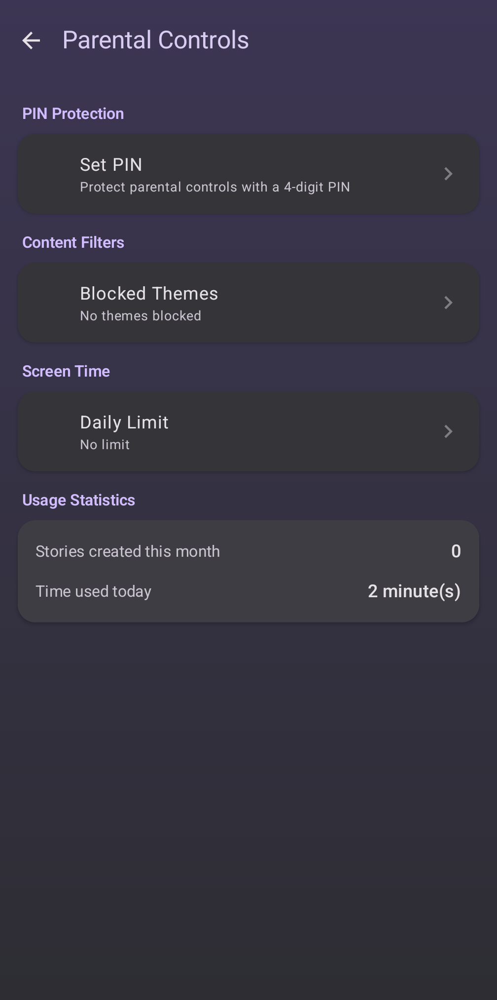
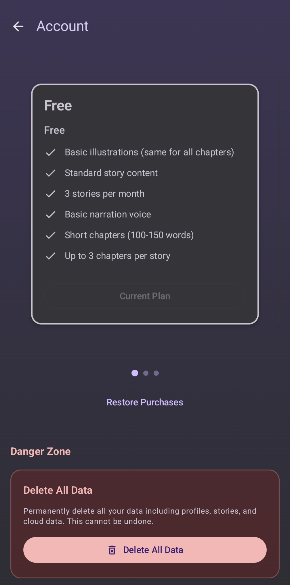

# Privacy Policy for Taleria

**Last Updated:** March 4, 2026

Taleria ("we", "our", or "the app") is a children's storytelling application that generates personalized stories using artificial intelligence. This privacy policy explains how we collect, use, and protect information when you use our app.

## Information We Collect

### Information You Provide
- **Child Profiles:** Name, age, and gender
- **Story Preferences:** Selected themes, avatars, and story settings
- **Parental Controls:** PIN code, blocked themes, screen time limits

### Information Collected Automatically
- **Device Identifier:** An anonymous device ID used to manage your subscription and usage quotas
- **Usage Data:** Monthly story generation counts and quota tracking
- **Order Data:** Story generation order history and status

### Information Generated by the App
- **Stories:** AI-generated story text, illustrations, and audio

## How We Use Information

- To generate personalized stories based on profile settings
- To save stories locally for later reading
- To manage subscription tiers and enforce usage limits
- To provide parental control features
- To process and fulfill story generation orders

## Data Storage

### On-Device (Local)
The following data is stored only on your device:
- Child profiles (name, age, gender)
- Saved stories, chapters, illustrations, and audio
- App settings and parental control preferences

### Server-Side
The following data is stored on our servers to provide the service:
- Anonymous device identifier
- Subscription tier and device mapping
- Monthly usage quotas and story generation counts
- Story order history and status

We do not store child names, ages, or any personally identifiable information on our servers.

## Third-Party Services

### AI Story Generation
Story generation uses third-party AI services. When generating a story:
- Story parameters (theme, age bracket, character type) are sent to AI providers
- No personally identifiable information is shared with AI providers
- Generated content is returned and stored locally on your device

### Payment Processing
Subscription payments are processed by **Paddle** (paddle.com), who acts as our Merchant of Record. Paddle handles all payment processing, invoicing, sales tax, and refunds. We do not directly store or handle your payment information (credit card numbers, billing addresses). Payment data is managed entirely by Paddle subject to their [Privacy Policy](https://www.paddle.com/legal/privacy).

### Subscription Management
We use third-party services to manage subscriptions and verify entitlements. These services receive your anonymous device identifier and subscription status.

### Analytics
We use Firebase Analytics to collect anonymous usage data such as app opens and feature usage. No personally identifiable information is collected through analytics. This data helps us improve the app experience.

## Children's Privacy (COPPA Compliance)

Taleria is designed for children ages 2-9 under parental supervision. We are committed to protecting children's privacy:
- We do not collect personal information directly from children
- All personal data (child profiles) remains on the device
- Server-side data uses anonymous device identifiers only
- Parents can delete all local and cloud data at any time through the app
- The app does not use behavioral profiling

## Your Rights Under GDPR

If you are located in the European Economic Area (EEA), you have the following rights regarding your data:

- **Right of Access**: You may request a copy of the data we hold about you
- **Right to Rectification**: You may request correction of inaccurate data
- **Right to Erasure**: You may delete your data instantly via the in-app "Delete All Data" feature (Settings > Account > Danger Zone), or request deletion by email (see [Data Deletion](https://joytect.github.io/taleria-legal/delete))
- **Right to Restriction**: You may request that we limit processing of your data
- **Right to Data Portability**: You may request your data in a portable format
- **Right to Object**: You may object to the processing of your data

To exercise any of these rights, contact us at **taleriasupport@gmail.com**. We will respond within 30 days.

## Parental Controls

  

Parents can:
- Set a PIN to protect settings
- Block specific story themes
- Set daily screen time limits
- View usage statistics
- Delete profiles and stories

## Data Deletion

### In-App Deletion (Recommended)

You can delete all your data directly from the app:
1. Go to **Settings** > **Account**
2. Scroll to the **Danger Zone** section
3. Tap **Delete All Data** and confirm

  

This immediately deletes all local data (stories, profiles, settings) and all cloud data (device identity, usage quotas, subscription mappings).

### Other Options

- **Uninstall the app** to remove all locally stored data
- **Email us** if you have already uninstalled — see our [Data Deletion page](https://joytect.github.io/taleria-legal/delete)

## Data Security

We use industry-standard measures to protect your data, including encrypted connections (HTTPS) for all server communications. Server-side data is stored on secure infrastructure with access controls.

## Changes to This Policy

We may update this privacy policy from time to time. Changes will be reflected in the "Last Updated" date.

## Contact Us

If you have questions about this privacy policy, please contact us at:

**Email:** taleriasupport@gmail.com

---

© 2026 Taleria. All rights reserved.
