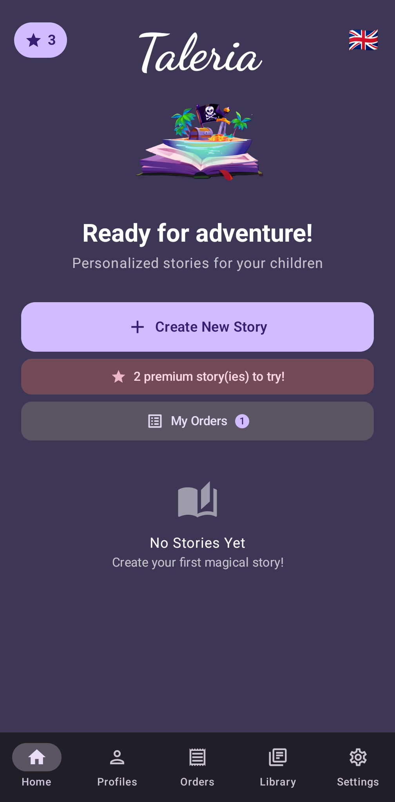
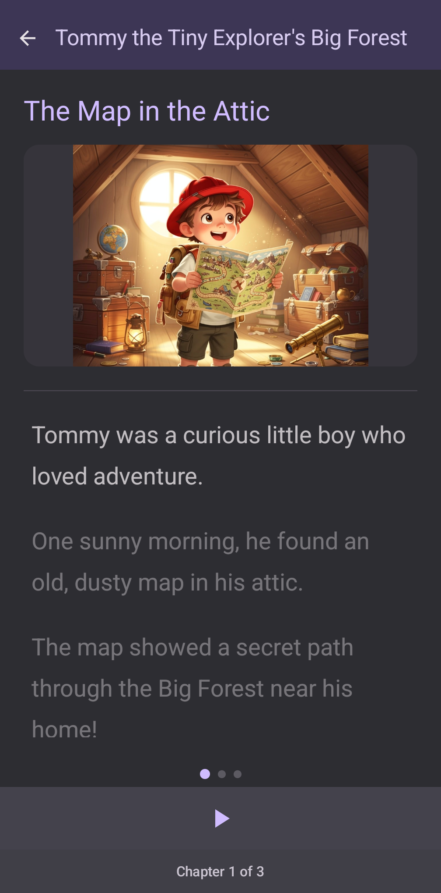

# Taleria

**Personalized AI-powered story generation for children ages 2–9**

---

## What is Taleria?

Taleria is a mobile app that creates unique, personalized bedtime stories for children using artificial intelligence. Parents choose a theme, a character, and story settings: and the app generates a fully illustrated, chapter-by-chapter story tailored to their child's age and interests.

The app is designed exclusively for use by children under parental supervision, with built-in parental controls to ensure a safe experience.

Every story is different. Every story is theirs.

  
  

---

## Key Features

### Personalized Story Generation
- Choose from **9 story themes** (adventure, fantasy, animals, space, and more)
- Pick a character from **30 avatars**
- Stories adapt vocabulary and complexity to the child's age (2–9 years)

### Chapter-by-Chapter Reading
- Stories broken into digestible chapters
- Illustrated with AI-generated artwork (Pro & Max tiers)
- Narration with AI-generated voices (Pro & Max) or device text-to-speech (Free)

### Child Profiles
- Create profiles for multiple children
- Each profile stores name, age, and preferences
- Stories are tailored per profile

### Story Library
- Save and re-read favorite stories
- Cloud library recovery for subscribers

---

## Parental Controls

Taleria is built with child safety as a core priority. The app includes a full parental control system, protected behind a PIN code, giving parents complete oversight over their child's experience:

- **PIN-Protected Settings**: All settings and parental controls are locked behind a parent-defined PIN, preventing children from modifying restrictions
- **Theme Blocking**: Parents can block specific story themes they consider inappropriate for their child
- **Daily Screen Time Limits**: Parents can set a maximum daily usage duration; the app enforces the limit automatically
- **Age-Appropriate Content**: Story vocabulary, complexity, and themes are adapted to the child's age bracket (toddler, preschool, early reader)
- **Usage Statistics**: Parents can view monthly usage stats to monitor how the app is being used
- **Profile Management**: Parents create and manage child profiles, controlling which themes and settings are available

Children cannot access settings, make purchases, or change parental restrictions without the PIN.

---

## Subscription Tiers

| | Free | Pro | Max |
|---|---|---|---|
| **Stories / month** | 3 | 10 | 20 |
| **Chapters per story** | Up to 3 | Up to 6 | Up to 8 |
| **Chapter length** | Short | Short & Medium | All sizes |
| **Illustrations** | Basic | AI-generated | AI-generated |
| **Narration** | Device TTS | AI voices | AI voices |
| **Devices** | 1 | 1 | Up to 3 |
| **Monthly** | Free | $12.99/mo | $16.99/mo |
| **Yearly** | Free | $129.90/yr | $169.90/yr |

[View full pricing details →](https://joytect.github.io/taleria-legal/pricing)

---

## Platform Availability

- **Android** (Google Play)
- **iOS** (App Store)

Built with Kotlin Multiplatform for a native experience on both platforms.

---

## AI Content Generation

Taleria uses AI to generate both story text and illustrations. All generated content is:

- **Fictional storybook illustrations**: no real person's likeness is used or generated
- **Age-appropriate**: stories are designed for children ages 2–9
- **Moderated**: parents can block specific themes and set content filters via parental controls
- **Original**: each story and illustration is uniquely generated, not sourced from copyrighted material

The app does not generate human-like faces in realistic form, face swaps, deepfakes, voice impersonations, or any content based on a real person's likeness.

---

## Safety & Privacy

- Designed for children ages 2–9 under parental supervision
- Anonymous analytics only (Firebase); no data selling
- Full parental control system with PIN protection
- Content filtering and theme blocking built in
- Compliant with children's privacy regulations

[Read our Privacy Policy →](https://joytect.github.io/taleria-legal/)

---

## Contact

**Email:** [taleriasupport@gmail.com](mailto:taleriasupport@gmail.com)

---

© 2026 Taleria. All rights reserved.
