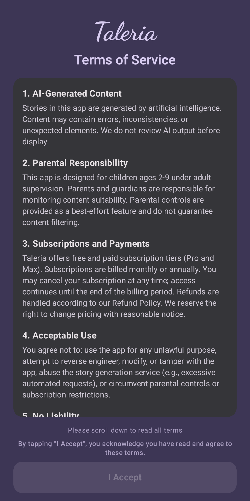

# Terms of Service for Taleria

**Last Updated:** March 4, 2026

Taleria ("we", "our", or "the app") is a children's storytelling application that generates personalized stories using artificial intelligence. By using Taleria, you agree to the following terms.

  

## 1. AI-Generated Content

Stories in this app are generated by artificial intelligence. Content may contain errors, inconsistencies, or unexpected elements. We do not review AI output before display.

## 2. Parental Responsibility

This app is designed for children ages 2-9 under adult supervision. Parents and guardians are responsible for monitoring content suitability. Parental controls are provided as a best-effort feature and do not guarantee content filtering.

## 3. Subscriptions and Payments

- Taleria offers free and paid subscription tiers (Pro and Max)
- The free tier is ad-supported with age-appropriate ads; paid tiers (Pro and Max) are ad-free
- Subscriptions are billed monthly or annually
- You may cancel your subscription at any time from within the app under **Settings > Account > Manage Subscription**; access continues until the end of the billing period
- You may delete all your data from within the app under **Settings > Account > Delete All Data**. Data deletion is permanent and cannot be undone. Deleting your data does not cancel your active subscription — you must cancel your subscription separately via Paddle
- Refunds are handled according to our [Refund Policy](https://joytect.github.io/taleria-legal/refund)
- We reserve the right to change pricing with reasonable notice

## 4. Acceptable Use

You agree not to:
- Use the app for any unlawful purpose
- Attempt to reverse engineer, modify, or tamper with the app
- Abuse the story generation service (e.g., excessive automated requests)
- Circumvent parental controls or subscription restrictions

## 5. No Liability

We are not responsible for the nature, accuracy, or appropriateness of AI-generated content. The app is provided "as is" without warranties of any kind, express or implied. Use at your own risk.

## 6. Content Limitations

Despite safety measures, AI may occasionally generate unexpected content. Theme filters are best-effort and not guaranteed. If you encounter inappropriate content, please report it immediately.

## 7. Data Usage

Stories are generated using third-party AI services. Story parameters (theme, age bracket, character type) are sent to AI providers to generate content. We also store anonymous device identifiers and usage data on our servers to manage subscriptions and enforce usage limits. No personally identifiable information (such as child names or ages) is stored on our servers. For full details, see our [Privacy Policy](https://joytect.github.io/taleria-legal/).

## 8. Intellectual Property

- The Taleria app and its original content are owned by Taleria
- AI-generated stories are provided for your personal, non-commercial use
- You may not redistribute or sell AI-generated content

## 9. Changes to These Terms

We may update these terms from time to time. Changes will be reflected in the "Last Updated" date. Continued use of the app after changes constitutes acceptance of the revised terms.

## Contact Us

If you have questions about these terms, please contact us at:

**Email:** joytect25@gmail.com

---

© 2026 Taleria. All rights reserved.
